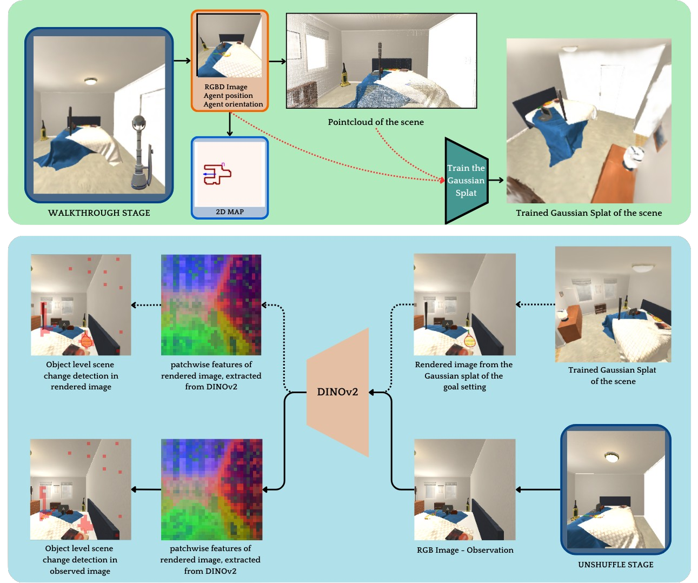

<p align="center">

  <h1 align="center">SplatR: Experience Goal Visual Rearrangement with 3D Gaussian Splatting and Dense Feature Matching</h1>
  <p align="center">
    <a href="https://rjnps.github.io/"><strong>Arjun P S</strong></a>
    ·
    <a href="https://www.linkedin.com/in/andrewmelnik/"><strong>Andrew Melnik</strong></a>
    ·
    <a href="https://sites.google.com/iiita.ac.in/gcnandi/home"><strong>Gora Chand Nandi</strong></a>
  </p>
  <h3 align="center"><a href="https://arxiv.org/abs/2411.14322">Paper</a> | <a href="https://splat-r.github.io/">Project Page</a></h3>
  <div align="center"></div>
</p>

<p>
We present a novel approach that uses 3D Gaussian Splatting for experience goal visual rearrangement. 
</p>

<p align="center">
  <a href="">
    
  </a>
</p>

## Installation
Clone the following repositories

```bash
git clone https://github.com/splat-r/splatr/
cd splatr
git clone https://github.com/facebookresearch/dinov2.git
cd ..
```

SplatR was benchmarked for Python 3.9, Cuda 11.8, Torch 2.0.1. The requirements.txt file contains the dependencies for Dinov2 as well, so there's no need to install it from source.

```bash
conda create -n splatr python=3.9
conda activate splatr
pip install xformers==0.0.18
conda install pytorch==2.0.1 torchvision==0.15.2 torchaudio==2.0.2 pytorch-cuda=11.8 -c pytorch -c nvidia
conda install -c fvcore -c iopath -c conda-forge fvcore iopath
conda install pytorch3d==0.7.4 -c pytorch3d
pip install -r requirements.txt
```

## Rearrange task
To run the rearrange task for a random scene, set `_random_scene_ = True` in `\rearrange\scripts\config.py` and to run it for a specific scene, set `_random_scene_ = False` and `_scene_id_=<unique_id_of_the_scene>`.


After setting that, run this to perform the rearrange task -

```bash
python rearrange_task.py
```
The data collected during the Walkthrough Phase will be stored in `\rearrange\test\dataset\<episode_id>\`, the visualizations of the run will be avilable in `\rearrange\test\runs\<episode_id>\`, and the final metrics will be saved in `\rearrange\metrics\`.
The dataset stored in `\rearrange\test\dataset\<episode_id>\` will be in the <a href="https://colmap.github.io/">COLMAP</a> format.


`\rearrange\scripts\config.py` contain Gaussian Splat configuration, parameters of the models used (DINO, CLIP, SAM), AI2THOR scene parameters and map parameters.

## Acknowledgement

We use the following open-source code in our work

- 3D Gaussian Splatting
  - [SuGaR](https://github.com/Anttwo/SuGaR)
  - [3D Gaussian Splating](https://github.com/graphdeco-inria/gaussian-splatting)
  - [LangSplat](https://github.com/minghanqin/LangSplat)
- Rearrangement task
  - [TIDEE](https://github.com/Gabesarch/TIDEE/)


## Citation

If you find our paper and code useful, please cite us

```bib
@misc{s2024splatrexperiencegoal,
      title={SplatR : Experience Goal Visual Rearrangement with 3D Gaussian Splatting and Dense Feature Matching}, 
      author={Arjun P S and Andrew Melnik and Gora Chand Nandi},
      year={2024},
      eprint={2411.14322},
      archivePrefix={arXiv},
      primaryClass={cs.RO},
      url={https://arxiv.org/abs/2411.14322}, 
}
```